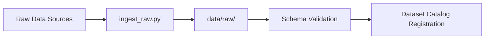
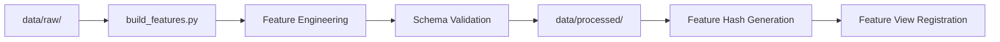
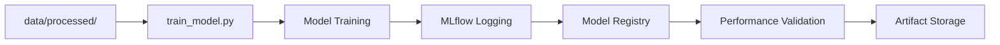

# DuetMind Adaptive MLOps Architecture

This document describes the hybrid MLOps architecture implemented for the DuetMind Adaptive project, providing reproducible machine learning pipelines with advanced agent memory capabilities.

## Architecture Overview

The MLOps architecture is designed in three incremental phases, each building upon the previous to create a comprehensive, production-ready system.

### Phase 1: Reproducibility & Data Foundations ✅
**Status**: Implemented and operational

**Components**:
- **Data Pipeline**: Automated ingestion, feature engineering, and validation
- **Schema Validation**: Pandera-based data contracts and quality checks
- **Experiment Tracking**: MLflow integration for model versioning and metrics
- **Feature Hashing**: Deterministic schema consistency verification

### Phase 2: Centralized Metadata & Infrastructure ✅
**Status**: Implemented

**Components**:
- **Database Schema**: PostgreSQL with custom metadata tables
- **Container Infrastructure**: Docker Compose stack (Postgres + Minio + MLflow)
- **Database Migrations**: Alembic-managed schema evolution
- **Object Storage**: MinIO for artifact storage with S3 compatibility
- **Metadata Registry**: Custom tables for datasets, features, and models
- **Backfill Scripts**: Historical data registration utilities

### Phase 3: Advanced Memory & Automation ✅
**Status**: Implemented

**Components**:
- **Vector Memory**: pgvector-based agent memory storage
- **Drift Detection**: Framework for data and model drift monitoring
- **Agent Memory**: Semantic embedding storage for agent reasoning
- **Production Monitoring**: Performance and quality metrics tracking

## Directory Structure

```
mlops/
├── pipelines/              # Core ML pipeline scripts
│   ├── ingest_raw.py      # Data ingestion from various sources
│   ├── build_features.py  # Feature engineering and transformation
│   └── train_model.py     # Model training and evaluation
├── validation/            # Data validation and quality checks
│   └── schema_contracts.py # Pandera schema definitions
├── infra/                # Infrastructure and deployment
│   ├── docker-compose.yml # Container orchestration
│   ├── alembic/          # Database migrations
│   │   └── versions/     # Migration scripts
│   └── init.sql          # Database initialization
├── drift/                # Drift detection and monitoring
│   └── drift_monitor_stub.py # Drift detection framework
├── registry/             # Model lifecycle management
│   └── model_promotion.md # Promotion guidelines
└── config/              # Configuration management
    └── .env.example     # Environment template

scripts/
├── feature_hash.py      # Feature schema hashing utility
└── backfill_metadata.py # Metadata registration script

agent_memory/
└── embed_memory.py      # Vector memory for agent reasoning
```

## Data Flow Architecture

### 1. Data Ingestion Pipeline



**Process**:
1. Raw data ingested from multiple sources (CSV, APIs, databases)
2. Data validated against raw schema contracts
3. Metadata extracted and stored in dataset catalog
4. Data quality metrics computed and logged

### 2. Feature Engineering Pipeline



**Process**:
1. Raw data transformed using configurable feature engineering logic
2. Features validated against feature schema contracts
3. Deterministic feature hash computed for consistency tracking
4. Processed data saved as Parquet files for efficiency
5. Feature metadata registered in feature view table

### 3. Model Training Pipeline



**Process**:
1. Features and labels loaded from processed data
2. Model trained with hyperparameters from params.yaml
3. Metrics and artifacts logged to MLflow
4. Model registered in custom model registry
5. Performance validated against thresholds
6. Artifacts stored with versioning

## Infrastructure Components

### Database Schema

The PostgreSQL database contains the following core tables:

#### Dataset Catalog
- **Purpose**: Track all datasets in the system
- **Key Fields**: name, file_path, schema_hash, row_count, metadata_json
- **Indexing**: Optimized for schema hash lookups

#### Feature View
- **Purpose**: Track feature engineering transformations
- **Key Fields**: feature_hash, feature_list, transformation_logic
- **Relationships**: Links to source datasets

#### Model Registry
- **Purpose**: Central model lifecycle management
- **Key Fields**: name, version, mlflow_run_id, status, performance_metrics
- **States**: staging → production → archived

#### Agent Memory (pgvector)
- **Purpose**: Store agent reasoning embeddings
- **Key Fields**: session_id, content, embedding, importance_score
- **Capabilities**: Semantic similarity search, memory associations

### Container Stack

The Docker Compose infrastructure provides:

1. **PostgreSQL**: Metadata storage with pgvector extension
2. **MinIO**: S3-compatible object storage for artifacts
3. **MLflow Server**: Centralized experiment tracking with database backend
4. **Adminer**: Database administration interface

**Starting Infrastructure**:
```bash
make infra-up          # Start all services
make db-migrate        # Run database migrations  
make backfill-metadata # Register existing data
```

## Configuration Management

### Parameters (params.yaml)
Central configuration file containing:
- Data paths and file locations
- Model hyperparameters and training settings
- Database connection parameters
- Feature engineering specifications
- Drift detection thresholds

### Environment Variables (.env)
Sensitive configuration stored separately:
- Database credentials
- Object storage keys
- MLflow server settings
- API keys and secrets

## Development Workflow

### 1. Setup Development Environment
```bash
make setup-env         # Install dependencies and setup
make dev-setup         # Full development setup
```

### 2. Data Pipeline Development
```bash
make data              # Ingest raw data
make features          # Build and validate features
make validate          # Run schema validation
make hash-features     # Compute feature hashes
```

### 3. Model Development
```bash
make train             # Train model with current config
make mlflow-ui         # View experiments in browser
make reproduce         # Run full DVC pipeline
```

### 4. Quality Assurance
```bash
make test              # Run test suite
make lint              # Code quality checks
make format            # Auto-format code
```

## Production Deployment

### Model Promotion Process

Models follow a staged promotion workflow:

1. **Staging**: Initial validation and testing
2. **Production**: Live serving after approval
3. **Archived**: Deprecated models for compliance

**Promotion Criteria**:
- Performance thresholds (accuracy ≥ 85%, ROC AUC ≥ 0.80)
- Schema compatibility validation
- Business stakeholder approval
- Security and compliance checks

## Monitoring and Alerting

### Data Drift Detection

Automated monitoring for:
- **Statistical Distribution Changes**: KS tests, Wasserstein distance
- **Feature Drift**: Mean shifts, variance changes
- **Categorical Distribution**: Chi-square tests, TV distance
- **Performance Degradation**: Accuracy drops, latency increases

### Alert Thresholds
- **Critical**: Accuracy drop > 5%, error rate > 2%
- **Warning**: Accuracy drop > 2%, latency > 200ms
- **Info**: Minor performance fluctuations

### Monitoring Dashboards
- **MLflow UI**: Experiment tracking and model comparison
- **Adminer**: Database monitoring and queries
- **Custom Metrics**: Performance and drift dashboards

## Agent Memory System

### Vector Memory Architecture

The agent memory system provides semantic storage and retrieval:

```python
# Store reasoning memory
memory_id = memory_store.store_memory(
    session_id=session_id,
    content="Patient shows high MMSE but APOE4 genotype",
    memory_type="reasoning",
    importance=0.8
)

# Retrieve similar memories
memories = memory_store.retrieve_memories(
    session_id=session_id,
    query="APOE4 risk factors",
    limit=5
)
```

**Features**:
- **Semantic Search**: Vector similarity using sentence transformers
- **Memory Types**: reasoning, experience, knowledge
- **Importance Scoring**: Weighted retrieval based on relevance
- **Memory Associations**: Graph-based memory relationships
- **Session Management**: Isolated agent sessions

## Security and Compliance

### Data Protection
- Environment-based credential isolation
- Database connection encryption
- Artifact storage access controls
- Audit logging for all operations

### Model Governance
- Complete training data lineage
- Model artifact versioning and checksums
- Performance metrics tracking
- Automated compliance reporting

### Access Control
- Role-based database permissions
- API key management for services
- Network isolation for sensitive components
- Audit trails for all model operations

## Performance Optimization

### Database Performance
- Indexed schema hash lookups
- JSONB fields for flexible metadata
- Connection pooling for concurrent access
- Optimized queries for large datasets

### Pipeline Efficiency
- Parquet format for fast columnar operations
- DVC caching for expensive computations
- Parallel processing where applicable
- Incremental updates for large datasets

### Storage Optimization
- Object storage for large artifacts
- Compression for historical data
- Automated cleanup of old artifacts
- Efficient vector embedding storage

## Troubleshooting Guide

### Common Issues

**Pipeline Failures**:
```bash
make test              # Run tests to identify issues
make validate          # Check data schema compliance
dvc status             # Check pipeline dependencies
```

**Database Issues**:
```bash
make infra-logs        # Check container logs
make db-migrate        # Apply pending migrations
docker compose restart # Restart services
```

**Performance Issues**:
- Monitor MLflow UI for training metrics
- Check drift detection logs for data quality
- Verify resource allocation in containers
- Review database query performance

### Debug Commands
```bash
# Check pipeline status
dvc dag                # View pipeline graph
dvc status            # Check for changes

# Database diagnostics
make backfill-metadata # Re-register metadata
psql -h localhost -U duetmind duetmind_mlops  # Direct DB access

# Container diagnostics
docker compose logs mlflow  # MLflow server logs
docker compose logs postgres  # Database logs
```

## Future Enhancements

### Planned Features
1. **Advanced Drift Detection**: Evidently integration for comprehensive monitoring
2. **A/B Testing Framework**: Automated model comparison in production
3. **Feature Store Integration**: Feast or custom feature serving layer
4. **Advanced Security**: Vault integration, encryption at rest
5. **Kubernetes Deployment**: Scalable container orchestration

### Scaling Considerations
- Distributed training for large datasets
- Multi-region deployment for global availability
- Advanced caching strategies for high-throughput serving
- Real-time feature computation and serving

## Contact and Support

- **MLOps Team**: mlops@duetmind.ai
- **Data Science Team**: ds-team@duetmind.ai
- **Documentation**: [Internal Wiki](https://wiki.duetmind.ai/mlops)
- **Issue Tracking**: [GitHub Issues](https://github.com/duetmind/adaptive/issues)